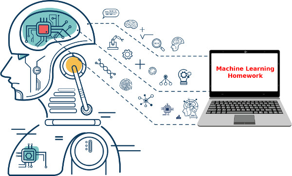

# 机器学习与人工智能 - 作业与报告

> 这个仓库是机器学习课程作业的备份仓库。
>
> 原网址：https://gitee.com/Immortalqx/machinelearning_homework
>
> **请将其用于学习目的，勿用于上课！**
>
> **Use it for learning purposes, do not steal it for classes!**

机器学习越来越多应用到飞行器、机器人等领域，其目的是利用计算机实现类似人类的智能，从而实现装备的智能化与无人化。本课程旨在引导学生掌握机器学习的基本知识、典型方法与技术，通过具体的应用案例激发学生对该学科的兴趣，鼓励学生能够从人工智能的角度来分析、解决飞行器、机器人所面临的问题和挑战。本课程主要内容包括Python编程基础，机器学习模型，无监督学习、监督学习、深度学习基础知识与实现，并学习如何利用机器学习解决实际问题。课程的讲义等学习资料在[《机器学习与人工智能》在线网站](https://gitee.com/pi-lab/machinelearning_notebook)，课程讲座的视频在[《B站 - 机器学习与人工智能》](https://www.bilibili.com/video/BV1oZ4y1N7ei/)。





由于这门课程需要大量的编程、练习才能学好，因此需要大家积极把作业做好，通过作业、练习来牵引学习、提高解决问题的能力、自学等能力。

关于如何提交作业，如何使用[Git](https://gitee.com/pi-lab/learn_programming/tree/master/6_tools/git/README.md)，[Markdown](https://gitee.com/pi-lab/learn_programming/blob/master/6_tools/markdown/README.md)等等，可以参考各自的教程和使用帮助。

* [English Description](README_ENG.md)


## 1. 要求

**本课程主要的目的是在学习基本理论的基础上，锻炼大家如何将理论和编程实现结合，因此需要大家独立自主完成作业和报告**

* **作业**主要目的是锻炼大家写程序，写算法的能力，因此作业里面的程序，需要自己实现，不能直接调用已有的库。可以使用`numpy`等基本库，不能直接使用`sklearn`等机器学习库

* **报告**主要的目标是锻炼大家解决复杂问题的综合能力，因此不强制要求大家必须要自己实现所有的算法，但是整个数据处理的流程需要自己独立思考、实现、实验。

* **作业需要全部完成，报告可以选择自己擅长的3个以上。**

  

## 2. 具体的操作步骤

1. [大家fork这个项目到自己的项目](https://gitee.com/pi-lab/learn_programming/blob/master/6_tools/git/HowToForkClone.md)
2. [然后git clone自己的项目到本地机器](https://gitee.com/pi-lab/learn_programming/blob/master/6_tools/git/HowToForkClone.md)
3. 在本目录新建一个`name.txt`文件（UTF-8编码），写下自己的名字和学号，例如
```
布树辉
2011010101
```
4. 在作业的目录里写入各自的代码、报告等。
5. 将增加、修改的文件提交到本地
```
git add -A
git commit -m "change description"
```
6. 通过`git push origin master`上传作业到自己的Gitee项目里
    - 其中`origin`是远端服务器的名字
    - `master`是git分支的名字（默认是master)


更多关于Git的用法可以阅读 [Git教程](https://gitee.com/pi-lab/learn_programming/tree/master/6_tools/git/README.md)

大家提交作业后，我会在大家的项目里写入批注、建议等等，从而构建良好的反馈机制，能够更有效的取得学习效果。


## 3. 作业

1. [Python基础](homework_01_python/README.md)
2. [Numpy & Matplotlib](homework_02_numpy_matplotlib/README.md)
3. [kMeans](homework_03_kmeans/README.md)
4. [Logistic Regression](homework_04_logistic_regression/README.md)
5. [Neural Networks](homework_05_nn/README.md)


## 4. 报告

1. [交通事故理赔审核预测](report_01_accident_claims/README.md)
2. [Titanic](report_02_Titanic/README.md)
3. [Fashion](report_03_Fashion/README.md)
4. [Tetris](report_04_Tetris/README.md)
5. [Jigsaw-Puzzle](report_05_Jigsaw-Puzzle/README.md)
6. [Sudoku](report_06_Sudoku/README.md)


## 5. 使用帮助

* [学习资料汇总](https://gitee.com/pi-lab/machinelearning_notebook/blob/master/References.md)
* [Git教程](https://gitee.com/pi-lab/learn_programming/tree/master/6_tools/git/README.md)
* [Markdown教程](https://gitee.com/pi-lab/learn_programming/blob/master/6_tools/markdown/README.md)
