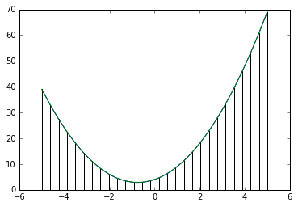
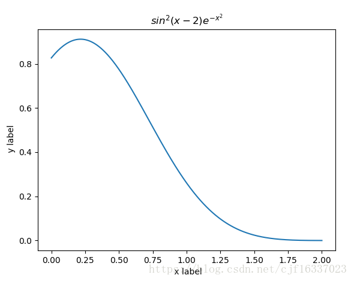
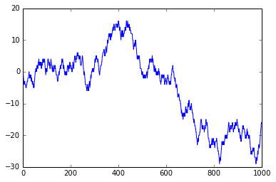

# Homework 02 - Numpy & Matplotlib

## 1. 数值计算 numpy


### 1.1 对于一个存在在数组，如何添加一个用0填充的边界?
例如对一个二维矩阵
```
10, 34, 54, 23
31, 87, 53, 68
98, 49, 25, 11
84, 32, 67, 88
```

变换成
```
 0,  0,  0,  0,  0, 0
 0, 10, 34, 54, 23, 0
 0, 31, 87, 53, 68, 0
 0, 98, 49, 25, 11, 0
 0, 84, 32, 67, 88, 0
 0,  0,  0,  0,  0, 0
```


### 1.2 创建一个 5x5的矩阵，并设置值1,2,3,4落在其对角线下方位置


### 1.3 创建一个8x8 的矩阵，并且设置成国际象棋棋盘样式（黑可以用0, 白可以用1）


### 1.4 求解线性方程组

给定一个方程组，如何求出其的方程解。有多种方法，分析各种方法的优缺点（最简单的方式是消元方）。

例如
```
3x + 4y + 2z = 10
5x + 3y + 4z = 14
8x + 2y + 7z = 20
```

编程写出求解的程序


### 1.5 翻转一个数组（第一个元素变成最后一个）


### 1.6 产生一个10x10大小的随机数组，并且找出最大和最小值


## 2. Matplotlib


## 2.1 画出一个二次函数，同时画出梯形法求积分时的各个梯形
例如：



## 2.2 绘制函数 $f(x) = sin^2(x - 2) e^{-x^2}$

需要画出标题，x，y轴。x的取值范围是[0, 2]




### 2.3 模拟一个醉汉在二维空间上的随机漫步。

例如1维的情况是：

x轴表示步子，y轴表示游走的位置

如果对于二维，则x，y分别是游走的位置。当然也可以画成三维，其中z比表示步子。


## Reference

* [100 numpy exercises](https://github.com/rougier/numpy-100)