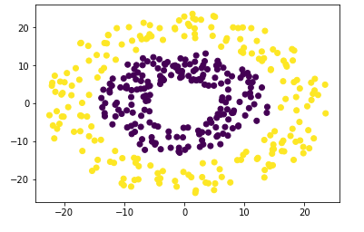

## Homework 03 - kMeans

自己编写kMeans方法，并使用下面的数据来做聚类

数据文件是：`dataset_circles.csv`，其中

* 数据的第一列是`x`坐标，
* 第二列是`y`坐标，
* 第三列是样本点的类别。

**要求：**

1. 使用**自己编写的聚类方法**对数据进行聚类
2. 将数据可视化出来，自己分析数据的特点，找到一种方法将数据进行某种变换，在变换后的空间上使用自己编写的kMeans方法对数据进行聚类处理
3. 自己查找其他的聚类方法，尝试使用一下，看看效果如何。（最好能自己编写）

