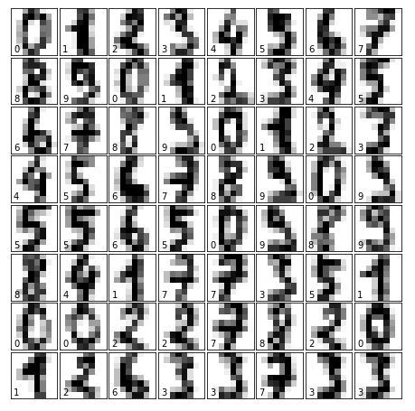

# Homework 04 - Logistic Regression

自己编程实现Logistic Regression的多分类问题。使用的数据可以是sklearn的digital数据。



加载数据的方式是：
```
import matplotlib.pyplot as plt 
from sklearn.datasets import load_digits

# load data
digits = load_digits()

# plot the digits
fig = plt.figure(figsize=(6, 6))  # figure size in inches
fig.subplots_adjust(left=0, right=1, bottom=0, top=1, hspace=0.05, wspace=0.05)

# plot the digits: each image is 8x8 pixels
for i in range(64):
    ax = fig.add_subplot(8, 8, i + 1, xticks=[], yticks=[])
    ax.imshow(digits.images[i], cmap=plt.cm.binary)
    
    # label the image with the target value
    ax.text(0, 7, str(digits.target[i]))
```


**要求：**

1. 自己编程实现Logistic Regression的多分类。
2. 对比自己实现与sklearn的方法的精度。
3. 如何将分类错误的样本可视化出来？