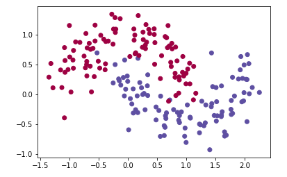
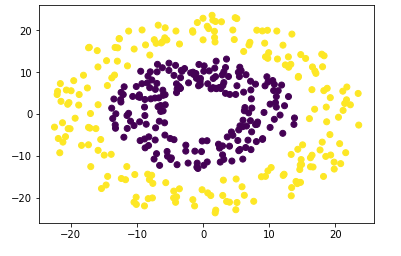
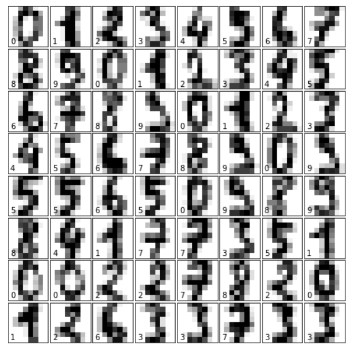

# Homework 05 - Neural Networks

自己编程实现两层或多层全连接神经网络，可以使用`moons` 、`circles`、或者`digits`数据集来测试、验证算法。


**dataset_moons**:




**dataset_circles**:




**dataset_digits**:




加载数据的方式是：
```python
# moon dataset
% matplotlib inline
import numpy as np
from sklearn import datasets
import matplotlib.pyplot as plt

# generate sample data
np.random.seed(0)
X, y = datasets.make_moons(200, noise=0.20)

# plot data
plt.scatter(X[:, 0], X[:, 1], c=y, cmap=plt.cm.Spectral)
plt.show()
```

dataset_circles的数据文件是`dataset_circles.csv`

dataset_digits的加载方式：
```python
import matplotlib.pyplot as plt 
from sklearn.datasets import load_digits

# load data
digits = load_digits()

# copied from notebook 02_sklearn_data.ipynb
fig = plt.figure(figsize=(6, 6))  # figure size in inches
fig.subplots_adjust(left=0, right=1, bottom=0, top=1, hspace=0.05, wspace=0.05)

# plot the digits: each image is 8x8 pixels
for i in range(64):
    ax = fig.add_subplot(8, 8, i + 1, xticks=[], yticks=[])
    ax.imshow(digits.images[i], cmap=plt.cm.binary)
    
    # label the image with the target value
    ax.text(0, 7, str(digits.target[i]))
```


**要求**：

1. 先用函数的方式实现网络的正向计算和反向误差传播，权值更新。
2. 构思并实现基于类的神经网络程序。
3. 构建多分类的网络（可以使用`dataset_digits`）。
4. 学习`softmax`和`cross entropy`的方法，并实现类别所属概率的输出。
5. 对比自己实现与sklearn的方法的精度。
6. 如何将分类错误的样本可视化出来？
