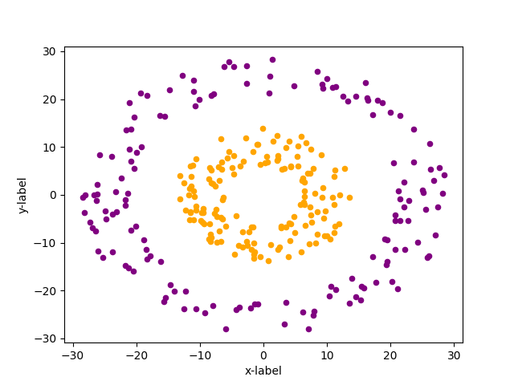
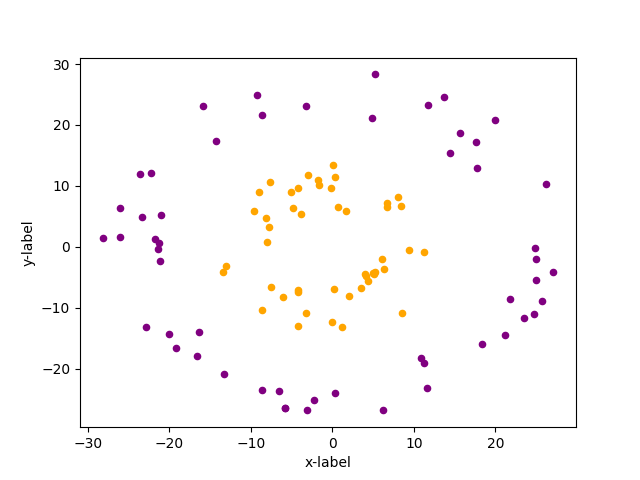
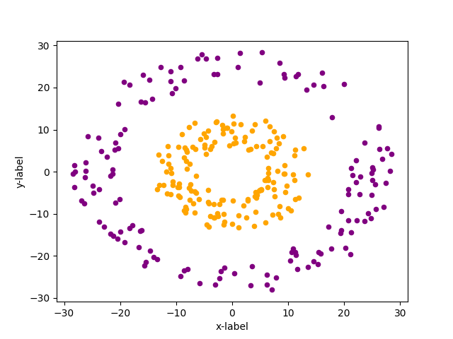
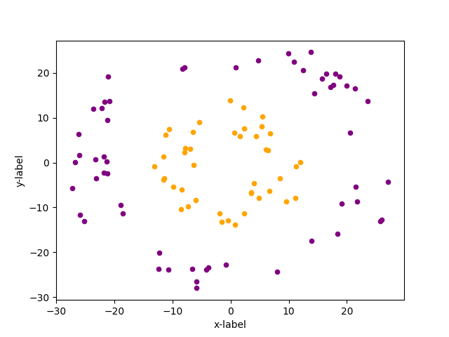
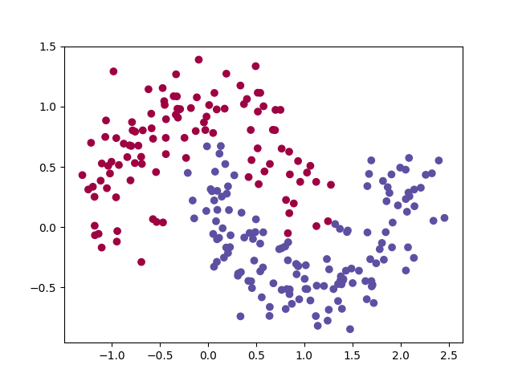
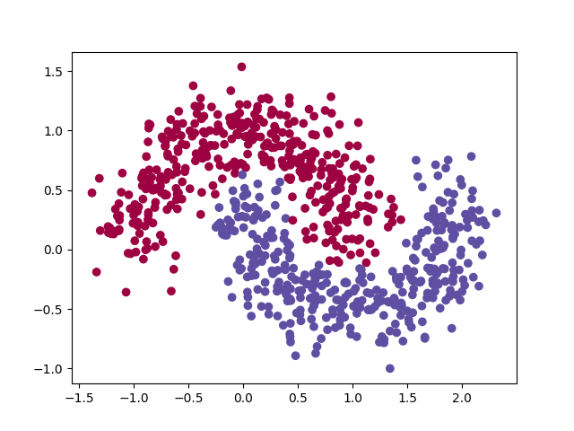
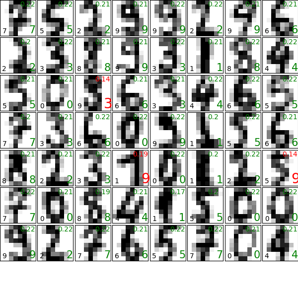
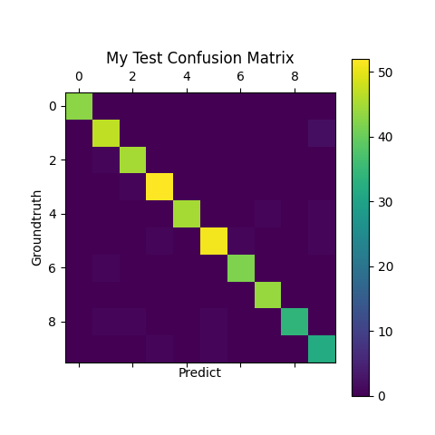
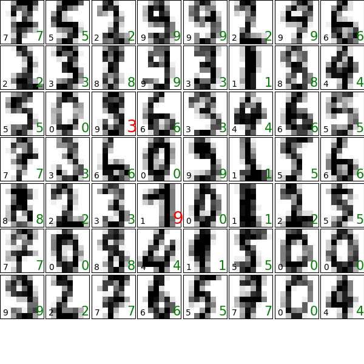
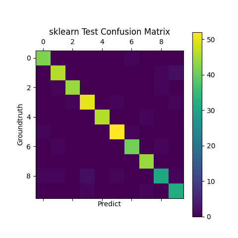

# Result

## circles

**终端输出**

```
MyNN 训练用时:	0.728545 s
MyNN 对训练集做预测:	 1.0
MyNN 对测试集做预测:	 1.0
sklearn 训练用时:	2.704032 s
sklearn 对训练集做预测:	 1.0
sklearn 对测试集做预测:	 1.0
```

**MyNN 训练集测试结果**



**MyNN 训练集测试结果**



**sklearn 训练集测试结果**



**sklearn 测试集测试结果**



## moons

**终端输出**

```
MyNN 训练用时:	0.660563 s
MyNN 对训练集做预测:	 0.9706666666666667
MyNN 对测试集做预测:	 0.96
sklearn 训练用时:	9.209319 s
sklearn 对训练集做预测:	 0.9746666666666667
sklearn 对测试集做预测:	 0.952
```

**MyNN 训练集测试结果**


**MyNN 训练集测试结果**



**sklearn 训练集测试结果**



**sklearn 测试集测试结果**


## digits

**终端输出**

```
Loss:5661.218912 accuracy0.100223
Loss:1332.399971 accuracy0.100223
Loss:1218.177300 accuracy0.102450
............
Loss:32.263688 accuracy0.997030
Loss:32.210868 accuracy0.997030
Loss:32.158215 accuracy0.997030
# 这个时间是有问题的！
MyNN 训练用时:	106.417476 s
MyNN 对训练集做预测:	 0.9970304380103935
MyNN 对测试集做预测:	 0.9666666666666667
sklearn 训练用时:	9.181445 s
sklearn 对训练集做预测:	 1.0
sklearn 对测试集做预测:	 0.9511111111111111
```

**MyNN 测试集测试结果**

右上角为预测概率，右下角为预测结果



混淆矩阵



**sklearn 测试集测试结果**



混淆矩阵

