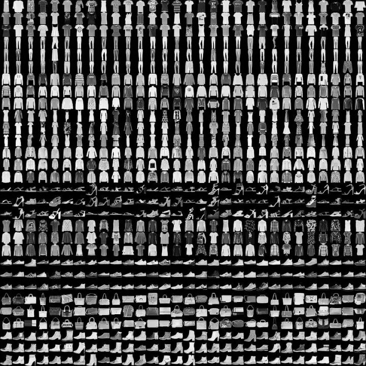

# Report3 - 服装分类

FashionMNIST 是一个替代 [MNIST 手写数字集](https://link.zhihu.com/?target=http%3A//yann.lecun.com/exdb/mnist/)的图像数据集。 它是由 Zalando（一家德国的时尚科技公司）旗下的研究部门提供。其涵盖了来自 10 种类别的共 7 万个不同商品的正面图片。

FashionMNIST 的大小、格式和训练集/测试集划分与原始的 MNIST 完全一致。60000/10000 的训练测试数据划分，28x28 的灰度图片。你可以直接用它来测试你的机器学习和深度学习算法性能，**且不需要改动任何的代码**。

这个数据集的样子大致如下（每个类别占三行）：

## 要求：

1. 构建深度神经网络，完成多分类。
2. 编写爬虫程序，到taobao等网站抓取一些衣服、鞋子的图片，并利用训练好的模型进行分类（如果实在爬不到数据，可以想办法搞一些类似的数据）。
3. 对于未属于训练数据集中的商品类别，考虑使用何种方法能够判断出类别为`不支持的类别`？
4. 评估自己抓取图像的分类精度。
5. 分析结果的效果，综合考虑各种方法，改进方法，并提交结果。
6. 按照`report_template.ipynb`撰写自己的报告。

## References

* [数据的官网](https://github.com/zalandoresearch/fashion-mnist)

