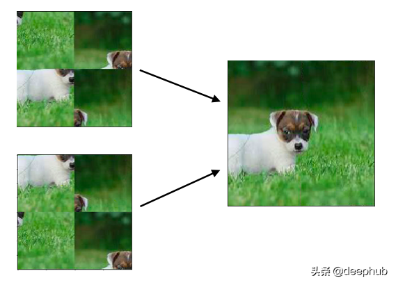
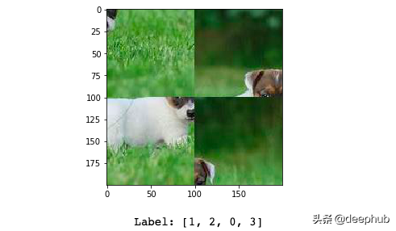

# Report5 - 拼图游戏

拼图游戏是广受欢迎的一种智力游戏，它的变化多端，难度不一。拼图游戏也有置换不变性，不管拼图的顺序是什么，输出总是固定的。下面是一个2x2的网格难题的例子，我们将在这个项目中尝试解决它。



解决一个3x3网格的难题是极其困难的。下面是这些谜题的可能组合。

```
2x2 puzzle = 4! = 24 combinations 
3x3 puzzle = 9! = 362880 comb'ns
```

为了解决一个3x3的难题，网络必须从362880中预测出一个正确的组合。这也是为什么3x3拼图是一个难题的另一个原因。

为了让大家学习如何使用卷积神经网络，首先尝试解决一个2x2的拼图游戏。


## 数据

这个数据集包含2x2和3x3的puzzle。你可以在这里找到它。

https://www.kaggle.com/shivajbd/jigsawpuzzle

下面是一个2x2网格拼图的数据示例。输入是一个200x200像素的图像和标签是一个4个整数的数组，其中每个整数告诉每个片段的正确位置。




## 要求

1. 分析拼图游戏的特点，设计实现的方法。
2. 在Kaggle网站上，下载数据（如果无法访问网站，则需要学习如何科学上网）。
3. 编写神经网络代码，测试自己算法的效果如何。
4. 测试所研究方法的效果。
5. 分析自己实现的方法的问题，以及如何改进。
6. 深入思考，如何解决3x3的拼图？或者更大的拼图？
7. 按照`report_template.ipynb`撰写自己的报告。


## References

* https://www.kaggle.com/shivajbd/jigsawpuzzle