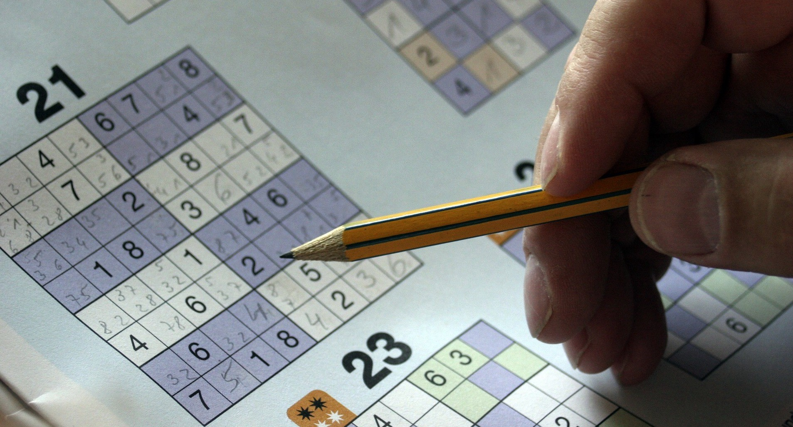
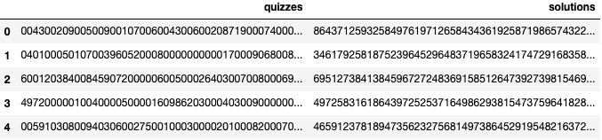

# Report6 - 数独


数独（shù dú, Sudoku）是源自18世纪[瑞士](https://baike.baidu.com/item/瑞士/131482)的一种数学游戏。是一种运用纸、笔进行演算的[逻辑游戏](https://baike.baidu.com/item/逻辑游戏/12814189)。玩家需要根据9×9盘面上的已知数字，推理出所有剩余空格的数字，并满足每一行、每一列、每一个粗线宫（3*3）内的数字均含1-9，不重复。

数独盘面是个九宫，每一宫又分为九个小格。在这八十一格中给出一定的已知数字和解题条件，利用逻辑和推理，在其他的空格上填入1-9的数字。使1-9每个数字在每一行、每一列和每一宫中都只出现一次，所以又称“九宫格”。



是否可以用卷积神经网络(CNN)解决数独问题。数独有空间特征，因为它有特殊的数字排列，而CNN擅长提取空间特征，尝试使用CNN来求解数独。


## 数据
这个数据集包含了1百万数独的数据，你可以在这里找到它。

https://www.kaggle.com/bryanpark/sudoku


示例的数据如下所示




数据集包含2列。`quizzes`栏目是未解的游戏，`solutions`栏目各自的已解游戏。每场比赛都由81个数字组成的字符串表示。以下是从字符串转换而来的9x9数独。数字0代表未解游戏中的空白位置。

```
[[0 0 4 3 0 0 2 0 9]
 [0 0 5 0 0 9 0 0 1]
 [0 7 0 0 6 0 0 4 3]
 [0 0 6 0 0 2 0 8 7]
 [1 9 0 0 0 7 4 0 0]
 [0 5 0 0 8 3 0 0 0]
 [6 0 0 0 0 0 1 0 5]
 [0 0 3 5 0 8 6 9 0]
 [0 4 2 9 1 0 3 0 0]]
```


## 要求

1. 分析数独游戏的特点，设计实现的方法。
2. 在Kaggle网站上，下载数据（如果无法访问网站，则需要学习如何科学上网）。
3. 编写神经网络代码，测试自己算法的效果如何。
4. 测试所研究方法的效果。
5. 分析自己实现的方法的问题，以及如何改进。
6. 深入思考，如何使用强化学习的方法实现求解数独问题？
7. 按照`report_template.ipynb`撰写自己的报告。


## References

* https://www.kaggle.com/bryanpark/sudoku